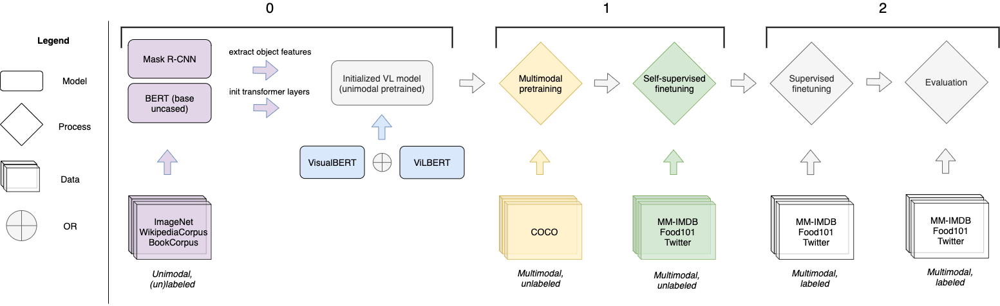
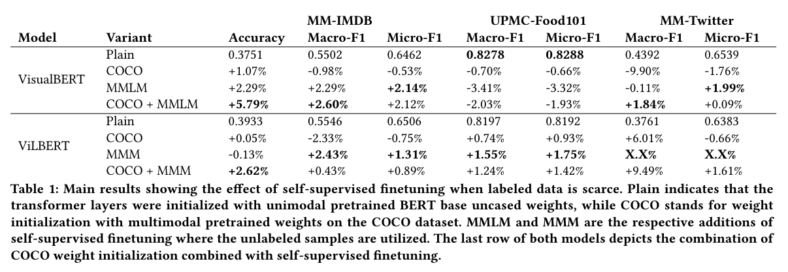

# Self-Supervised Finetuning of Vision-Language Models for Classification Tasks

This repository contains the source code for the above mentioned research project.
It extends [MMF](https://github.com/facebookresearch/mmf) with two multimodal datasets: UPMC-Food101 and MM-Twitter (not publicly available).

The Experiments were run on a SLURM-based research cluster and the scripts can be found inside the folder `slurm_jobs`.

Each of these scripts is initialized as indicated with 0 in the figure and consists of either processes 1 or 2.



MMF is highly configurable, which is seen in the mmf_run statement at the end of each slurm script. For testing, `run_type` just needs to be set to `test`.
```
mmf_run config=projects/vilbert/configs/mmimdb/defaults.yaml \
    run_type=train_val \
    dataset=mmimdb \
    model=vilbert \
    training.fp16=True \
    training.tensorboard=True \
    training.batch_size=80 \
    training.update_frequency=1 \
    training.checkpoint_interval=500 \
    training.max_updates=20000 \
    scheduler.params.num_training_steps=20000 \
    training.clip_gradients=True \
    training.max_grad_l2_norm=0.25 \
    training.seed=45003754 \
    checkpoint.resume=True \
    checkpoint.max_to_keep=2
```

## Main results




